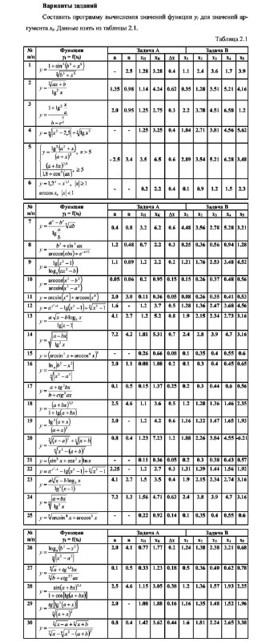

# Репозиторий для работ по курсу информатика

## Козлов Егор Александрович, группа 1/278 

Репозиторий основан на репозиториях https://github.com/ISUCT/Informatics_2023 (ветвь main) и https://github.com/ISUCT/Tprogramming_2022 (ветвь main). 

Основной стек &mdash; `C#`, но в репозитории присутствуют работы, выполненные на `Golang` (папка `golang`).

# История изменений
## Лабораторные работы 1, 2 & 3 (Вариант 11) [Fri Sep 22 22:27:17 2023]
Для выполнения работ был исользован язык программирования `Golang`. В соответствии с варинатом 11 была решена задача из списка ниже:

Unit-тесты написаны *не* были, хотя это было возможно сделать *по желанию*.

## CodeWars [Fri Sep 22 22:26:56 2023]
Для решения задач использовался язык программирования `C#`. Был решён следующий список задач с сайта codewars:
https://www.codewars.com/kata/even-or-odd/

https://www.codewars.com/kata/54edbc7200b811e956000556

https://www.codewars.com/kata/56f69d9f9400f508fb000ba7

https://www.codewars.com/kata/5838e2978bbc04b7cd000008

https://www.codewars.com/kata/55f9b48403f6b87a7c0000bd

https://www.codewars.com/kata/59ca8246d751df55cc00014c

https://www.codewars.com/kata/53934feec44762736c00044b

https://www.codewars.com/kata/57ab2d6072292dbf7c000039

https://www.codewars.com/kata/59a9919107157a45220000e1

https://www.codewars.com/kata/5d5ee4c35162d9001af7d699

Все решения задач находятся в проекте `CodeWarsExercises`. 

Чтобы не засорять решение малеьнкими проектами было решено поместить исходный код задач в один проект. Чтобы было удобно запускать задачи, был написан небольшой консольный интерфейс:

